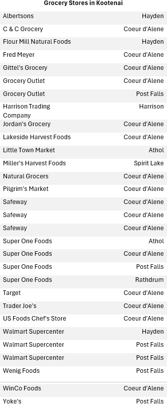
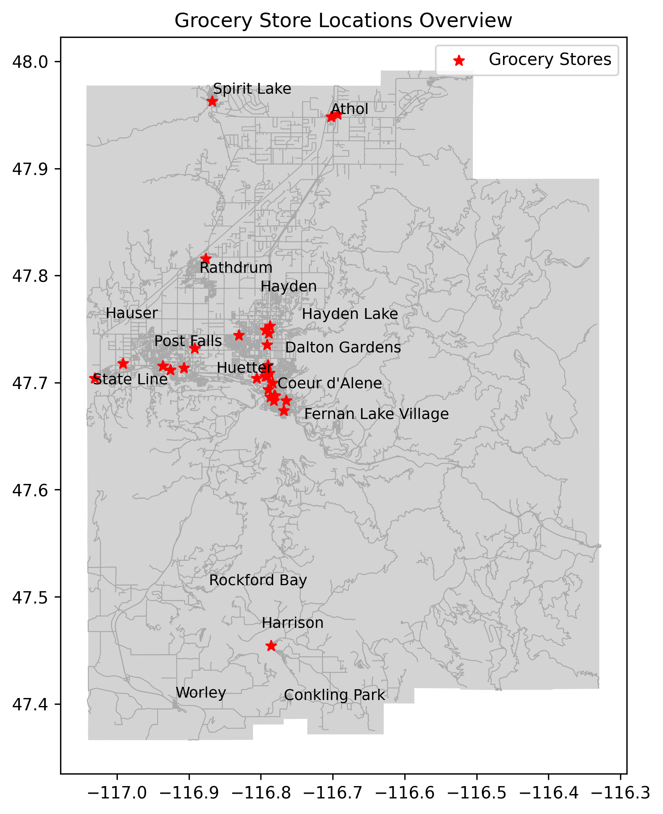
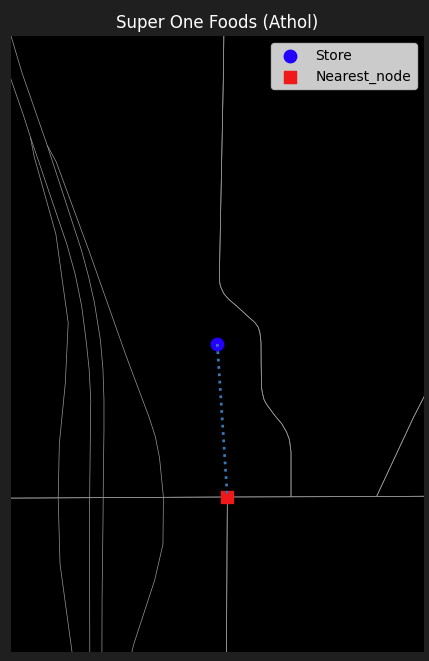
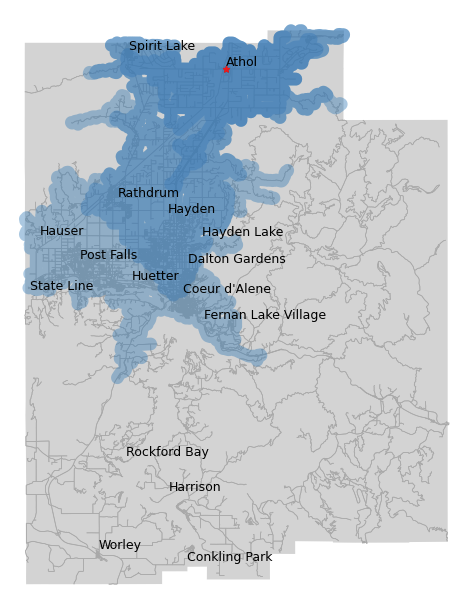
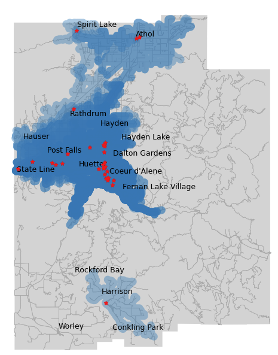
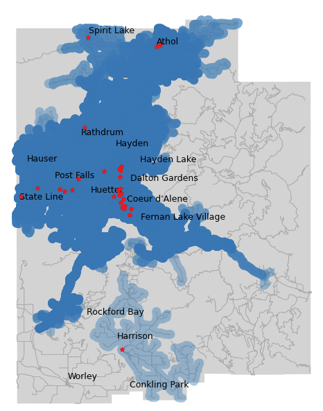
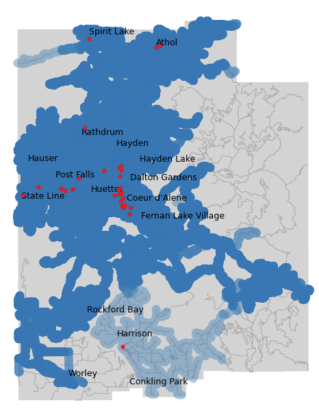
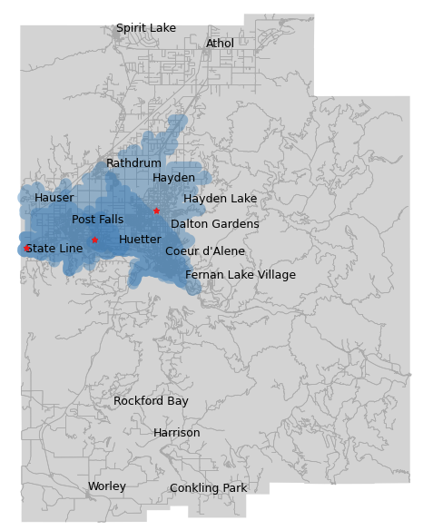
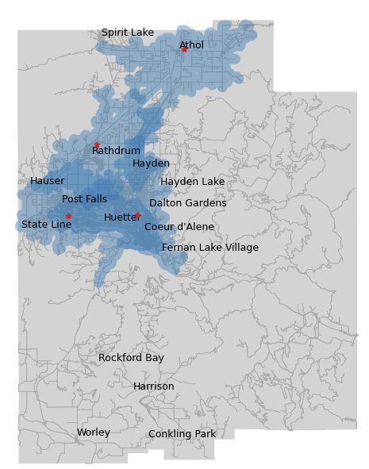

# Network-Based Grocery Store Accessibility Analysis 

## Project Overview
This project evaluates grocery store accessibility across Kootenai County, Idaho using road-network analysis. Access to grocery stores is an important component of community well-being, influencing food availability, travel burden, and quality of life, particularly in rural areas. 

Grocery store locations were collected from OpenStreetMap (OSM), cleaned, standardized, and analyzed using Python and GIS tools. Drive-time service areas representing 10-, 20-, and 30-minute travel times were generated for each grocery store using a road-network model. The project provides both static and interactive visualizations to examine grocery access across the county, compare coverage among grocery chains, and identify areas with limited access to food retail services. 


## Study Area
Kootenai County is located in northern Idaho and contains a mix of urban, suburban, and rural communities. Accessibility to grocery stores varies considerably across the county due to differences in population density, transportation infrastructure, and store distribution. 


## Objectives 
- Identify grocery store locations throughout Kootenai County
- Build a road-network model from OpenStreetMap data
- Generate 10-, 20-, and 30-minute drive-time service areas
- Compare accessibility among major grocery chains
- Explore geographic areas with limited grocery access
- Develop interactive tools for accessibility exploration


## Data Sources
| Dataset              | Source                             |
| -------------------- | ---------------------------------- |
| Grocery Stores       | OpenStreetMap                      |
| Road Network         | OpenStreetMap                      |
| City Boundaries      | Census Cartographic Boundary Files |
| County Census Tracts | Census Cartographic Boundary Files |


## Methodology

### Step 1: Store Collection and Cleaning
Grocery store locations were downloaded from OpenStreetMap using OSMnx. The dataset was reviewed to remove duplicate records, verify store classifications, and standardize store names. Both point and polygon store features were identified and standardized into a consisitent point-based dataset suitable for network analysis. 

The table and map below summarize grocery store locations identified in Kootenai County. Store locations are concentrated around the urban centers of Coeur d'Alene, Post Falls, and Hayden, while the northern and southern portions of the county contain substantially fewer grocery stores. 




### Step 2: Network Preparation
A drivable road network was downloaded from OpenStreetMap and converted into a graph structure suitable for network analysis. Each grocery store was connected to the nearest network node to enable travel-time calculations. Quality-control checks were performed to verify that store locations were correctly linked to the road network prior to service area generation. 

Each grocery store was connected to its nearest road-network node to enable network-based travel-time analysis. The maximum distance between a store and its assigned network node was approximately 276 meters (Super One Foods, Athol). The figure below illustrates the quality-control process used to verify that stores were correctly linked to the road network. All stores were found to have reasonable network connections suitable for service area generation. 

 

### Step 3: Service Area Generation
For each grocery store, network-based service areas representing 10-, 20-, and 30-minute driving times were generated. These service areas estimate the geographic extent reachable within each travel-time threshold using the road network. Travel times were estimated using road classfications and speed assumptions provided by OSMnx when posted speed limits were unavailable. 

Little Town Market in Athol was selected as an example to demonstrate the service area generation process. The 10-minute service area represents a relatively local market reach, while the 20- and 30-minute service areas expand along the transportation network toward neighboring communities. At a 30-minute travel threshold, the service area extends into portions of Hayden Lake, Post Falls, and Coeur d'Alene, illustrating how accessibility expands as travel time increases.



## Results

### Countywide Coverage
Service areas from all grocery stores were combined to evaluate overall grocery accessibility throughout Kootenai County. Results reveal substantial differences in grocery accessibility between urban centers and more rural portions of the county. 

The three maps below illustrate countywide grocery accessibility at 10-, 20-, and 30-minute travel thresholds. At 10 minutes, accessibility is concentrated around the major population centers of Coeur d'Alene, Hayden, and Post Falls. Coverage expands considerably at 20 minutes, particularly in northern portions of the county. By 30 minutes, most populated areas have access to multiple grocery stores, although portions of southern Kootenai County remain served by relatively few stores.





### Grocery Chain Comparision
Accessibility patterns were compared between major grocery chains to evaluate differences in service coverage and geographic reach. The comparison demonstrates how network analysis can be applied to retail site evalution and customer reach assessment. 

The maps below compare 10-minute service areas for Walmart and Super One Foods locations. While both chains provide similar coverage in the central portion of the county, Super One Foods achieves broader coverage in northern Kootenai County due to the presence of an additional store in Athol. This comparison demonstrates how store placement strategies influence market reach and customer accessibility.

 


### Interactive Accessibility Explorer 
An interactive dashboard was developed using Jupyter widgets, allowing users to:
- Select individual stores
- Select multiple stores simultaneously
- Toggle between 10-, 20-, and 30-minute service areas
- Explore accessibility patterns dynamically


## Key Findings
- Grocery stores are concentrated around the urban corridor of Coeur d'Alene, Hayden, and Post Falls.
- Accessibility increases substantially between 10- and 20-minute travel thresholds.
- Northern Kootenai County benefits from additional coverage provided by stores in Athol and surrounding communities.
- Store location strategies have a measurable impact on geographic market coverage. 


## Technologies Used
- Python
- Jupyter Notebook
- Git
- Pandas
- GeoPandas
- OSMnx
- Shapely
- Matplotlib
- ipywidgets
- NetworkX


## Repository Structure
```
grocery_stores_access/
├── data/
│ ├── raw/
│ └── processed/
│
├── notebooks/
│
├── outputs/
│
├── src/
│
├── README.md
└── requirements.txt
```
    

## Future Improvements
- Use actual speed-limit data
- Incorporate population and demographic data to identify underserved areas
- Compare accessbility changes over time
- Deploy as a Streamlit web application 


## Key Skills Demonstrated
- Python-based GIS workflows
- GIS and spatial analysis
- Network analysis
- OpenStreetMap data acquisition, cleaning and standardization
- Geospatial data processing
- Accessibility modeling
- Interactive visualization development
- Cartographic design